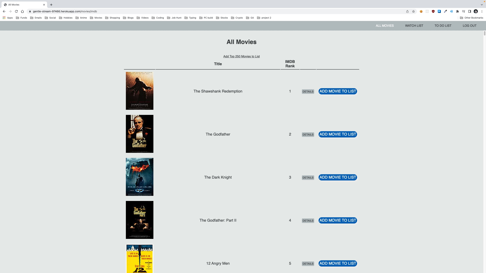
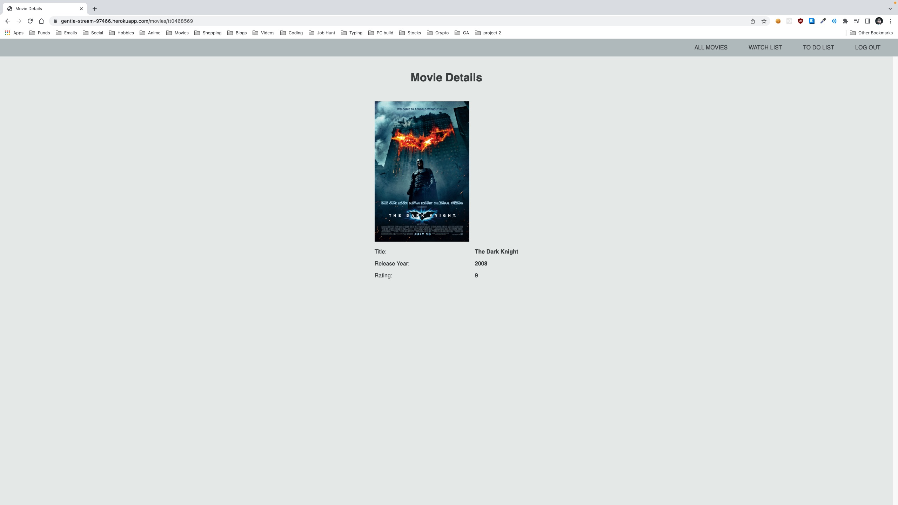
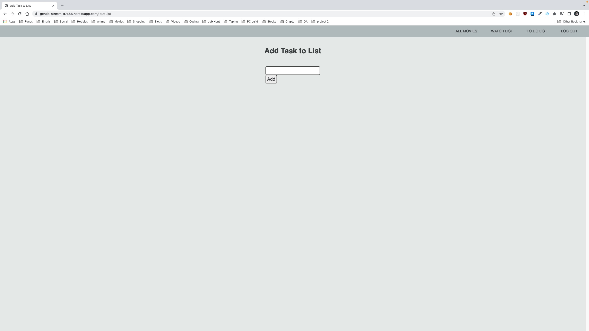

# To Do List with a hint of movies
Built with Node, Express, MongoDB, Mongoose, JavaScript, HTML, and CSS

### Keep track of tasks you need to complete and also look at the top 250 movies on IMDB

### Launch deployed web app: [Here](https://gentle-stream-97466.herokuapp.com/movies)

### Assests used:
* IMDB api

### Future Planned Enhancements:
* Allow users to add movies to watch list 
* Add a messaging feature between users 
* Add friends list feature 

